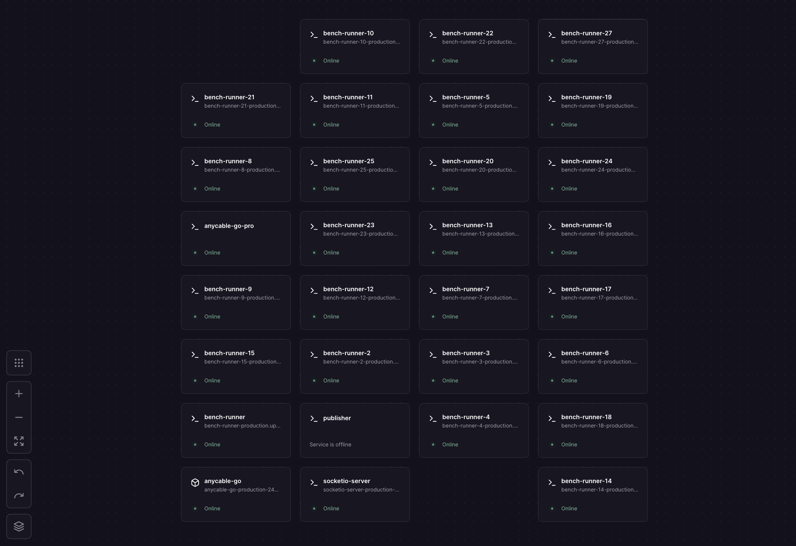

# Node.js WebSocket Bench

The repo behind [anycable.io/compare/nodejs-websocket](https://anycable.io/compare/nodejs-websocket). Five WebSocket setups, three questions, one rule: same Railway hardware for every row.

- Does it deliver messages when clients drop and reconnect?
- Does it survive a deploy?
- How many idle connections will a single instance hold?

Setups under test: default Socket.io, Socket.io + Connection State Recovery, uWebSockets.js, AnyCable OSS, AnyCable Pro.

Sixth target, [socketioxide](https://github.com/totodore/socketioxide) (Rust Socket.io server), benchmarked head-to-head with AnyCable on the same Railway hardware. Results in [its own section below](#socketioxide-rust-socketio); deep dive in [`docs/socketioxide-comparison.md`](./docs/socketioxide-comparison.md).

The same harness also drives the **Rails** comparison (Action Cable vs Solid Cable vs Async::Cable vs AnyCable) behind [anycable.io/compare/rails-actioncable](https://anycable.io/compare/rails-actioncable): one Rails app, four adapters, same box. Results in [its own section below](#rails-action-cable--solid-cable--asynccable--anycable); deep dive in [`docs/rails-comparison.md`](./docs/rails-comparison.md).

Methodology, traps, and the bugs we caught in our own setup: [`docs/methodology.md`](./docs/methodology.md). Below: the numbers and how to rerun them.

## Headlines

All numbers from one Railway region, Pro tier, 32 vCPU / 32 GB. Bench-runner shards run alongside the targets on the internal network so the driver is never the bottleneck.

### Delivery under jitter: 10K clients, 120 broadcasts at 2/sec

Every client's TCP socket gets force-closed every ~15 s and stays offline ~2 s before reconnecting. ~8 jitter events per client over the 160 s test.

|                          | Default Socket.io | Socket.io + CSR | uWS         | AnyCable OSS | AnyCable Pro |
| ------------------------ | ----------------- | --------------- | ----------- | ------------ | ------------ |
| Deliveries lost          | **184,449**       | **0**           | **153,805** | **0**        | **0**        |
| Delivery rate            | **84.55%**        | **100%**        | **87.03%**  | **100%**     | **100%**     |
| CSR resume rate          | n/a               | 99.7%           | n/a         | n/a          | n/a          |
| Replay p50 (raw)         | 106 ms            | 148 ms          | 92 ms       | 250 ms       | 261 ms       |
| Replay p95               | 394 ms            | 1.97 s          | 0.72 s      | 4.10 s       | 4.10 s       |
| Replay p99               | 1.07 s            | 4.58 s          | 1.72 s      | 6.14 s       | 6.15 s       |
| Replay max               | 1.75 s            | 9.71 s          | 2.95 s      | 9.23 s       | 9.36 s       |

At-most-once protocols drop whatever landed during the offline window. Replay protocols deliver everything; CSR's tail is slightly shorter at p99 in this in-memory comparison. AnyCable wins elsewhere: separate Go process so app deploys don't sever connections, horizontal scaling via NATS or Redis with replay intact, native client-to-client whispers, Ruby + Rails + Node + Bun + Deno backends.

### Reconnection avalanche: 5,000 clients, one deploy

|                                | Socket.io    | AnyCable |
| ------------------------------ | ------------ | -------- |
| Connections dropped            | 5,000 (100%) | 0        |
| Recovery p50                   | 4,967 ms     | 0 ms     |
| Recovery p95                   | 5,992 ms     | 0 ms     |
| Clients that never came back   | 189 (3.8%)   | 0        |
| Total downtime                 | **~6.8 s**   | **0 s**  |

In-memory CSR can't save you here. Server state is lost on restart. Redis Streams CSR keeps the state, but the connections themselves still all sever. The avalanche is architectural.

### Idle capacity: how many connections one instance holds


*Fifty bench-runner shards, each in its own Railway container with its own source IP and ~64K outbound-port pool. The 1M idle test fans out across all of them. The per-IP port ceiling is the reason single-machine 1M is hard; this is how we get past it without kernel tuning.*

Single-instance target, 32 vCPU / 32 GB, one stream subscription per connection. Headline run: 1,000,000 idle clients via 25 × 40,000 shards.

| Server                      | Held         | Peak memory               | Peak CPU            | Wall                         |
| --------------------------- | ------------ | ------------------------- | ------------------- | ---------------------------- |
| Socket.io 4.x (Node 22)     | 119,826      | 6.3 GB                    | 1.34% (1 core)      | single Node event loop       |
| `anycable-go` (OSS)         | 993,994      | **32 GB** (box ceiling)   | 12.22% (~3.9 vCPU)  | physical RAM                 |
| `anycable-go-pro` v1.6.13   | **999,954**  | 19.34 GB                  | 9.37% (~3.0 vCPU)   | nothing, 13 GB still free    |

**33 KB per connection OSS, 19 KB Pro** at 1M. Pro is ~1.7× more efficient at this scale and ~2.4× at 200K. Socket.io's wall is architectural: handshakes serialize through one event loop regardless of memory. To reach 1M with Socket.io you run many Node processes behind a Redis adapter (~10K–30K per process).

OSS scaling line on the same box:

| Idle conns | OSS memory  | OSS CPU             |
| ---------- | ----------- | ------------------- |
| 1K         | 280 MB      | 0%                  |
| 10K        | 280 MB      | 0%                  |
| 20K        | 751 MB      | 1.08% (~0.3 vCPU)   |
| 50K        | 1.98 GB     | 1.08% (~0.3 vCPU)   |
| 100K       | 4.18 GB     | 1.62% (~0.5 vCPU)   |
| 200K       | 8.35 GB     | 2.63% (~0.8 vCPU)   |
| 994K       | 32 GB       | 12.22% (~3.9 vCPU)  |

## Methodology calls to flag

Three knobs that shape the numbers. Full reasoning in [`docs/methodology.md`](./docs/methodology.md).

- **Default Socket.io's offline window is floored to ~2 s** (`MIN_OFFLINE_MS` in `lib/core/timing.ts`). Otherwise the manual reconnect path stays offline only ~1 s and underreports the loss a real `socket.io-client` user sees with default `reconnection: true`. CSR, AnyCable, and uWS land near 2 s on their own because their client-library backoffs dominate. Same disruption shape across the board.
- **CSR runs with the in-memory adapter.** Simplest opt-in path. Redis Streams or MongoDB shift the tail by adding network RTT; structural picture holds. CSR is documented as incompatible with the Redis pub/sub adapter, so the "Redis adapter" most teams reach for first is the one CSR can't use.
- **AnyCable's jitter-row RAM is the tradeoff for parallel replay.** Its history buffer is per-stream so `history` parallelises across streams; that costs more RAM during jittery runs. Page-level RAM-per-connection comes from the idle test, where the per-connection footprint is what's measured.

## socketioxide (Rust Socket.io)

[socketioxide](https://github.com/totodore/socketioxide) speaks the Socket.io wire protocol in Rust. Its author asked us to benchmark it, so we ran it head-to-head with AnyCable on the same Railway hardware, AnyCable alongside as a same-window control. It answers a sharp question: which of Socket.io's problems are about the runtime language, and which are about the architecture?

**Latency (steady network).** Comparable to AnyCable. Nothing a user feels.

| | 1K p50 / p99 | 10K p50 / p99 | Delivery |
| --- | --- | --- | --- |
| socketioxide | 23 / 66 ms | 289 / 972 ms | 100% |
| AnyCable OSS | 16 / 46 ms | 232 / 731 ms | 100% |

**Delivery under jitter.** At-most-once, no replay. In the Socket.io band to 1K, then it falls off a cliff.

| Clients | socketioxide | AnyCable |
| --- | --- | --- |
| 200 (local) | 91.6% | 100% |
| 1,000 | 89.4% | 100% |
| 10,000 | **41% then 33%** (two runs) | 100% |

**Avalanche (app deploy).** Every connection dies on the deploy (in-process WS goes down with the app), and recovery collapses at scale, tracking Node Socket.io almost exactly.

| Clients | Reconnected | Recovery |
| --- | --- | --- |
| 5,000 | 100% | 2.9 s |
| 10,000 | 96% | 67 s |
| 20,000 | **0%** | never |

**Idle capacity.** Held **600K+** idle connections at ~37 KB each (comparable to AnyCable's ~39 KB), roughly 5x past Node Socket.io's ~120K event-loop ceiling. We could not find its true ceiling: the load-generation fleet caps near ~12K connections per shard (ephemeral ports), so the harness ran out before socketioxide did.

**The takeaway.** Rust fixes Socket.io's capacity ceiling, the single-event-loop wall that caps Node around 120K. It leaves two things untouched: at-most-once delivery (no replay protocol) and deploy fragility (the WS layer still dies with its app). Both live in the protocol and the topology, so swapping the language to Rust leaves them intact, and socketioxide collapses under jitter and deploy storms at scale the same way Node Socket.io does. AnyCable holds 100% on both because the WS layer is a separate process with replay. Full numbers and the deploy story: [`docs/socketioxide-comparison.md`](./docs/socketioxide-comparison.md).

## Rails (Action Cable / Solid Cable / Async::Cable / AnyCable)

The repo behind [anycable.io/compare/rails-actioncable](https://anycable.io/compare/rails-actioncable). Four WebSocket adapters for the **same Rails 8.1 app**, same Railway box, same shared-tenant window: Action Cable on Redis (Puma), Solid Cable on the database (Puma), Async::Cable on Falcon (`socketry/async-cable`, fiber reactor), and AnyCable in RPC mode (Rails gRPC backend + `anycable-go` gateway). All four are Action Cable-compatible at the app and client level, so the channels and Turbo Streams are identical; only `config/cable.yml`, the runtime, and the process topology change. The Puma targets are in `cable-bench/`, the Falcon target in `cable-bench-falcon/`; the AnyCable JS driver serves all four over the existing `bench-*-anycable` endpoints, parameterized by `cableUrl` / `broadcastUrl` / `channel` / `acProtocol`.

The one wire difference: Action Cable, Solid Cable and Async::Cable speak the base `actioncable-v1-json` protocol (at-most-once, no resume); AnyCable speaks the extended `actioncable-v1-ext-json` protocol (per-stream history, resume on reconnect). Switching Puma for Falcon (Async::Cable) changes the runtime, not the guarantees.

All numbers below are **sharded** (13 drivers, ~250 to 770 cables each). A single bench-runner holding thousands of cables saturates its own event loop and produces wrong numbers in both directions; see [Running the latency test](#running-the-latency-and-jitter-test-shard-it).

**Roundtrip latency (steady network, 100% delivery).** AnyCable leads at every scale: fan-out runs in Go, off the Ruby process.

| Adapter | 1K p50 / p99 | 5K p50 / p99 |
| --- | --- | --- |
| Solid Cable | 62 / 119 ms | 74 / 164 ms |
| Async::Cable (Falcon) | 11 / 80 ms | 20 / 71 ms |
| Action Cable (Puma) | 9 / 47 ms | 13 / 57 ms |
| AnyCable | **4 / 23 ms** | **7 / 31 ms** |

**Delivery under jitter (5K, ~2 s drops).** The base protocol has no resume, so the three in-process adapters lose the same ~22%; AnyCable replays per-stream history.

| Adapter | Delivery |
| --- | --- |
| Solid Cable | **78.1%** |
| Action Cable | **78.1%** |
| Async::Cable (Falcon) | **78.1%** |
| AnyCable | **99.9%** |

**Capacity: 10K under load + idle-to-break.** All four hold 10K at 100% delivery; AnyCable keeps the tightest tail (p99 31 ms vs 84 ms Action Cable, 112 ms Async::Cable, 200 ms Solid Cable). Pushed to failure on identical 32 GB boxes (default 8-worker config): Puma Action Cable and Solid Cable wall at ~52K on a file-descriptor ceiling (~2.5 GB RAM, not memory-bound); Async::Cable on Falcon runs out of memory at ~97K (~290 KB/conn); AnyCable held **600K with zero failures** across a 50-runner fleet (~47 KB/conn, ~27 GB, ~84% of the box), not driven to failure: the load fleet maxed out, not the server, so treat 600K as a floor. Finding a gateway's true ceiling takes ~1 load driver per 10K connections (a single Node driver tops out near 10K cables), so capacity-to-break runs scale the driver count to the target. Raw data in [`backend/results/rails-capacity-break-2026-06-28.json`](./backend/results/rails-capacity-break-2026-06-28.json).

**Deploy survival (avalanche, 5K, real app redeploy).** In-process drops every connection, Puma and Falcon alike, and stays down ~7.5 to 8 s before ~96% reconnect; AnyCable's gateway never sees the deploy, so 0 s of downtime. "Down for" is how long connections stayed dropped before the reconnect storm settled.

| Adapter | Dropped | Down for | Reconnected |
| --- | --- | --- | --- |
| Action Cable | all 5,000 | 7.5 s | 96.3% (187 still out at cutoff) |
| Solid Cable | all 5,000 | 7.6 s | 95.7% (215 still out at cutoff) |
| Async::Cable (Falcon) | all 5,000 | 8.0 s | 96.4% (179 still out at cutoff) |
| AnyCable | **0** | **0 s** | n/a |

**The takeaway.** On Rails, AnyCable leads on latency at every scale (7 ms p50 at 5K) and wins the things that decide whether realtime holds up: 100% delivery under jitter where the base protocol drops about a fifth of broadcasts, and connections that survive every app deploy. Capacity ties at everyday sizes (all four hold 10K at 100%) but splits past that: AnyCable held 600K idle connections where the Puma adapters wall at ~52K on a file-descriptor ceiling and Falcon runs out of memory at ~97K. Async::Cable on Falcon is a real alternative runtime to Puma with latency in the same range, but shares the in-process limits (at-most-once, deploy-fragile) and is the most memory-hungry by far. Solid Cable's edge is operational (no Redis), at the cost of a polling-latency floor. Full numbers: [`docs/rails-comparison.md`](./docs/rails-comparison.md). Raw results: [`backend/results/rails-sharded-2026-06-28.json`](./backend/results/rails-sharded-2026-06-28.json).

## Repository layout

```
benchmark/
├── docker-compose.yml             # Local Socket.io + anycable-go
├── railway.toml                   # Railway deploy config
├── docs/
│   ├── methodology.md             # How we built it and why
│   ├── railway-ops.md             # Resize, redeploy, fleet, pause
│   └── env.md                     # Full env-var reference
└── backend/
    ├── Dockerfile                 # One image; SERVICE_ENTRY picks the entry point
    ├── package.json
    ├── results/                   # published rails-*/socketioxide-* results tracked; raw run dumps ignored
    └── src/
        ├── publisher.ts                       # Standalone HTTP publisher (legacy)
        ├── socketio/server.ts                 # /_broadcast + /publish-local
        ├── uws/server.ts                      # uWebSockets.js comparison server
        ├── standalone-publisher/server.ts     # Publisher as a separate Railway service
        ├── bench-runner/server.ts             # Bearer-auth HTTP wrapper, deployed N times
        ├── bench/                             # Driver scripts; each is `npm run bench:<name>`
        │   ├── jitter-*.ts, avalanche-*.ts, throughput-*.ts, deploy-impact-*.ts
        │   ├── whispers.ts, whispers-multi.ts, idle-multi.ts
        │   ├── latency-trace-anycable.ts, jitter-anycable-trace.ts
        │   ├── fetch-jitter-metrics.ts, railway-metrics.ts
        │   ├── tests-manifest.ts              # Canonical list of every rebaseline test
        │   ├── rebaseline.ts                  # Walk manifest, regress vs baselines
        │   └── rebaseline-history.ts          # Per-metric trend across runs
        └── lib/
            ├── jitter-runners.ts, jitter-uws.ts, jitter-anycable-traced.ts
            ├── avalanche-runner.ts, avalanche-uws.ts
            ├── deploy-impact-runner.ts
            ├── standalone-deploy-impact-runner.ts
            ├── standalone-deploy-impact-anycable-runner.ts
            ├── whispers-runner.ts, throughput.ts, idle-runner.ts
            ├── anycable-trace.ts
            └── core/                          # Every runner imports from here
                ├── params, stats, timing, peak-rss, log, results-dir, chart
                ├── bench-runner-client        # Driver-side bearer-token fetch
                ├── job-queue                  # bench-runner async job state
                ├── shard-coordinator          # Multi-shard fan-out + merge
                └── railway-api                # Railway GraphQL
```

Local CLI scripts and the Railway-hosted HTTP endpoints call the same `runJitter*` / `runThroughput*` functions. Numbers are produced by one code path; only the trigger differs.

## Local quick-start

Requires Node.js 22+ and either Docker or a local `anycable-go` binary (`brew install anycable-go`).

```bash
cd backend
npm install
```

Two server terminals:

```bash
# Terminal 1: Socket.io (no CSR by default; set SOCKETIO_CSR=1 for CSR)
npm run dev:socketio                  # :3000

# Terminal 2: anycable-go
anycable-go --port 8080 --broker=memory --presets=broker --public
```

Third terminal, run any variant. Each script publishes its own messages.

```bash
# Default Socket.io
SOCKETIO_URL=http://localhost:3000 NUM_CLIENTS=50 DURATION=60 \
  TOTAL_MESSAGES=60 INTERVAL_MS=500 \
  npm run bench:jitter:socketio

# Socket.io + CSR (server must run with SOCKETIO_CSR=1)
SOCKETIO_URL=http://localhost:3000 NUM_CLIENTS=50 DURATION=60 \
  TOTAL_MESSAGES=60 INTERVAL_MS=500 \
  npm run bench:jitter:socketio-csr

# AnyCable
ANYCABLE_URL=ws://localhost:8080/cable BROADCAST_URL=http://localhost:8090/_broadcast \
  NUM_CLIENTS=50 DURATION=60 TOTAL_MESSAGES=60 INTERVAL_MS=500 \
  npm run bench:jitter:anycable
```

Output: delivery rate, jitter event count, latency percentiles (raw + min-normalized), runner peak RSS.

Local avalanche (Socket.io spawns, gets killed, restarts):

```bash
npm run build
NUM_CLIENTS=1000 PORT=4000 npm run bench:avalanche:socketio
```

For AnyCable the test confirms nothing happens (separate process, no disruption):

```bash
anycable-go --port 8080 --broker=memory --presets=broker --public &
NUM_CLIENTS=1000 ANYCABLE_URL=ws://localhost:8080/cable \
  BROADCAST_URL=http://localhost:8090/_broadcast \
  npm run bench:avalanche:anycable
```

## Railway: 10K-client jitter

Deploy three services in one project:

- `socketio-server` from this repo (`backend/Dockerfile`, `SERVICE_ENTRY=socketio/server`). Serves `/_broadcast` for per-message HTTP publishing and `/publish-local` for the diagnostic in-process emit path.
- `anycable-go` from the official image (`anycable/anycable-go:latest`) with `ANYCABLE_BROKER=memory`, `ANYCABLE_PRESETS=broker`, `ANYCABLE_PUBLIC=true`, `ANYCABLE_HTTP_BROADCAST_SECRET=<your-secret>`.
- `bench-runner` from this repo with `SERVICE_ENTRY=bench-runner/server`, `ANYCABLE_BROADCAST_SECRET=<same secret>`, `BENCH_RUNNER_TOKEN=<random 32+ chars>`.

Give `bench-runner` a public domain. With `BENCH_RUNNER_TOKEN` set, every `/bench-*` and `/jobs/*` request needs `Authorization: Bearer <token>`; `/health` stays open for Railway probes.

```bash
# AnyCable @ 10K
curl --max-time 320 -X POST \
  -H "Authorization: Bearer $BENCH_RUNNER_TOKEN" \
  "https://bench-runner-production.up.railway.app/bench-jitter-anycable?n=10000&duration=200&msgs=120&interval=500&jitter=15&jitterMs=1000&ramp=300&stream=run-ac"

# Default Socket.io @ 10K
curl --max-time 320 -X POST \
  -H "Authorization: Bearer $BENCH_RUNNER_TOKEN" \
  "https://bench-runner-production.up.railway.app/bench-jitter-socketio?n=10000&duration=200&msgs=120&interval=500&jitter=15&jitterMs=1000&ramp=300&stream=run-d"

# Socket.io + CSR @ 10K
curl --max-time 320 -X POST \
  -H "Authorization: Bearer $BENCH_RUNNER_TOKEN" \
  "https://bench-runner-production.up.railway.app/bench-jitter-socketio-csr?n=10000&duration=200&msgs=120&interval=500&jitter=15&jitterMs=1000&ramp=300&stream=run-csr"
```

Default mode is sync (blocks until the run finishes, typically 3 to 5 minutes at 10K). Add `?async=1` to get back `{jobId}` and poll `/jobs/:id` instead.

Response shape: `deliveryRatePct`, `lostDeliveries`, `expectedDeliveries`, `receivedDeliveries`, `jitterEvents`, `csrResumes`, `csrResumeRatePct`, `connectFailures`, `latencyRawMs` and `latencyOverMinMs` (`{avg,p50,p95,p99,max}` plus `skewFloor`), `runnerPeakRssMb`.

## Railway: avalanche

```bash
SOCKETIO_URL=https://your-socketio.up.railway.app NUM_CLIENTS=5000 \
  npm run bench:avalanche:railway
```

When the script reports "All clients connected", from a second terminal:

```bash
railway restart -s socketio-server --yes
```

## Connection capacity

`/bench-idle-anycable`, `/bench-idle-socketio`, `/bench-idle-uws` open N raw WebSockets to the target via internal network, hold for `holdSec`, return final counts.

Single shard (up to ~50K):

```bash
curl --max-time 600 -X POST -H "Authorization: Bearer $BENCH_RUNNER_TOKEN" \
  "https://bench-runner.up.railway.app/bench-idle-anycable?n=50000&hold=120&ramp=300"
```

Each Linux container has a ~64K per-source-IP outbound port pool, capping any single shard around 50K useful connections.

Multi-shard (100K to 1M) fans out across the 50-shard fleet. Deploying the fleet is in [`docs/railway-ops.md`](./docs/railway-ops.md#deploy-code-to-all-50-shards-in-parallel). Then:

```bash
SHARDS=$(printf 'https://bench-runner-production.up.railway.app'
         for i in $(seq 2 50); do
           printf ',https://bench-runner-%s-production.up.railway.app' "$i"
         done)

# 1M idle against anycable-go on 32 vCPU / 32 GB
SHARDS="$SHARDS" \
  PER_SHARD_N=20000 HOLD_SEC=120 RAMP_PER_SEC=200 \
  PROJECT_ID=<railway-project-uuid> SERVICE_ID=<anycable-go-service-uuid> \
  SERVICE_NAME=anycable-go \
  npm run bench:idle:multi

# Other targets: TARGET=socketio + SERVER_URL=...
#                TARGET=uws + UWS_WS_URL=...
```

`PROJECT_ID` and `SERVICE_ID` are optional. Without them the script reports aggregate counts; with them it pulls memory and CPU from Railway and writes a CSV.

## Re-baselining

A tests manifest lives at `backend/src/bench/tests-manifest.ts`. One command walks it:

```bash
cd backend
BENCH_RUNNER_URL=https://bench-runner-production.up.railway.app \
BENCH_RUNNER_TOKEN=<your-token> \
  npm run bench:rebaseline
```

Hits each bench-runner endpoint, writes results to `tmp/v1.6.14-bench-results/{id}.json`, prints a delta-vs-baseline report. Drift past the threshold goes yellow (`drift`); a delivery drop or a key-metric breach goes red (`regress`) and exits non-zero.

```
FILTER=jitter             # only jitter tests
FILTER=latency-anycable   # only AnyCable latency
FILTER=jitter,whispers    # comma-separated categories or substrings
DRY_RUN=1                 # print the plan
INCLUDE_IDLE=1            # add 4 idle tests (multi-shard, ~16 min)
INCLUDE_AVALANCHE=1       # add 5 avalanche tests (auto-redeploys server)
```

Full sweep: ~90 minutes wall-clock.

### Running the latency (and jitter) test: shard it

**Latency and jitter must be sharded. One bench-runner holding thousands of client cables saturates its single Node event loop, and the measured receive latency then reflects the test driver queueing frames, not the server.** This bites hardest for the `actioncable-v1-ext-json` client (AnyCable), which does extra per-message offset/ack work, so an unsharded run makes AnyCable look several times slower than it is. Keep each shard light: **~250 client cables per bench-runner** (the nodejs page uses 250/shard; 1K = 4 shards, 5K = 20 shards, 10K = 40 shards). The coordinator merges the union latency distribution across shards (`mergeJitterResults`), so percentiles stay honest. See [`docs/methodology.md`](./docs/methodology.md#cross-shard-percentile-honesty).

Set `numShards` + `perShardN` on the spec in `tests-manifest.ts` (e.g. `numShards: 20, perShardN: 250` for 5K), then point `BENCH_RUNNER_URLS` at **at least that many ONLINE runners**. The default pool assumes `bench-runner` + `bench-runner-2..50`; if some are stopped, list the live ones explicitly:

```bash
cd backend
# Build a URL list from a contiguous range of online runners (here 14..33 = 20 shards):
URLS=$(for i in $(seq 14 33); do printf 'https://bench-runner-%s-production.up.railway.app,' "$i"; done)

BENCH_RUNNER_TOKEN=<your-token> \
BENCH_RUNNER_URLS="${URLS%,}" \
FILTER=latency \
OUTPUT_DIR=tmp/latency-run \
  npm run bench:rebaseline
```

A spec without `numShards`/`perShardN` runs on a single bench-runner: fine for connection-count or delivery checks, wrong for latency. If a latency p50 jumps super-linearly with subscriber count (e.g. 15 ms at 1K to 225 ms at 5K), suspect an unsharded run before you suspect the server.

**Baselines vs the page numbers.** The page was captured during a noisy Railway shared-tenant window. The `baseline` field in `tests-manifest.ts` is what the same tests deliver on a quieter window: latencies ~50% better, everything else the same. So the page is the cautious "worst seen under shared-infra load" view, and the rebaseline tests against today's quieter floor. A green rebaseline says "we still beat today's floor", which is stricter than the page promises. When we refresh the page, baselines and page numbers move together.

Per-run history lives at `tmp/v1.6.14-bench-results/runs/{ISO-ts}/`. To watch each headline number move across runs:

```bash
npm run bench:rebaseline:history
LAST=10 FILTER=jitter npm run bench:rebaseline:history
```

## Environment variables

Most-used: `BENCH_RUNNER_URL` and `BENCH_RUNNER_TOKEN` for any Railway driver; `NUM_CLIENTS`, `DURATION`, `JITTER_INTERVAL`, `JITTER_DURATION`, `TOTAL_MESSAGES`, `INTERVAL_MS`, `RAMP_RATE` for the jitter scripts; `SOCKETIO_URL` / `ANYCABLE_URL` / `BROADCAST_URL` to retarget local scripts; `RESULTS_DIR` to redirect CSV/JSON output. Full reference: [`docs/env.md`](./docs/env.md).

Railway infrastructure recipes (resize, redeploy, deploy the 50-shard fleet, pause-after-tests cost control) live in [`docs/railway-ops.md`](./docs/railway-ops.md).

## Caveats worth knowing

- WebSocket-only transport on both sides. No long-polling fallback for Socket.io.
- AnyCable runs with the in-memory broker here. Production typically wants NATS or Redis for restart durability and multi-node fan-out.
- Publisher and subscribers are different processes by design (real-world latency model). Latency is reported both raw and min-normalized; the compare page uses the min-normalized view, with `skewFloor` exposed so you can spot a bad clock.
- Multi-shard min-normalization assumes each shard sees one fast sample. Reliable at 3 to 5 minute test windows; below ~60 s, sanity-check `skewFloor` per shard before trusting the merged p99.
- One bench-runner saturates around 50K subscribers (Node event-loop work, not memory). Above that, fan out via `bench/idle-multi.ts` or `bench/jitter-multi.ts`.
- Math.random isn't seeded. Runs reproduce statistically, not bit-for-bit. A few-ms p99 drift between runs is expected.
- `deliveryRatePct` denominator is `totalMessages × clients`. The JSON also carries `deliveryRateOfConnectedPct` so a run with connect failures isn't silently capped below 100%. In healthy runs (`connectFailures: 0`) the two are identical.

## About

Built by [AnyCable](https://anycable.io) alongside the compare page at https://anycable.io/compare/nodejs-websocket. Open issues or PRs if you find a methodological flaw; we'd rather fix it than leave a wrong number standing.

MIT, [LICENSE](./LICENSE).
